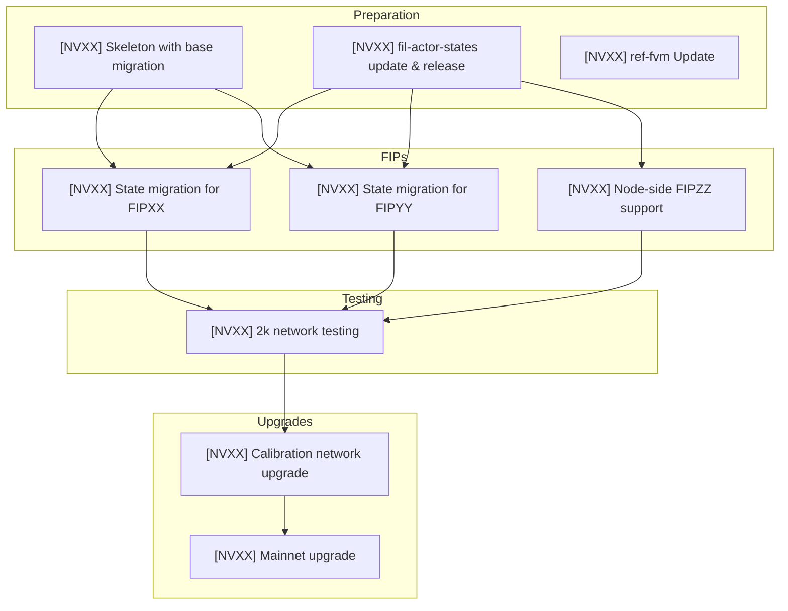

<!-- Replace NVXX with the actual network version number, e.g., NV27 -->

# Tracking issue for the NVXX network upgrade

<!-- Review the tasks below and modify as necessary. Each network upgrade has different set of FIPs and tasks. -->
<!-- Create sub-issues for each task. -->

## Tasks

<!-- Regular skeleton with the new network version; updating enums, adding empty migration, etc. Refer to previous network upgrade issues for reference. -->

- [ ] [NVXX] Skeleton with base migration
<!-- Grabbing the code from the `builtin-actors` repo, updating the version, releasing a new version of `fil-actor-states` and making sure it works with Forest. -->
- [ ] [NVXX] `fil-actor-states` update and release
<!-- Updating Forest to use the new `ref-fvm` dependencies. -->
- [ ] [NVXX] `ref-fvm` update
<!-- FIPs requiring state migrations. It's important to benchmark them and assess their impact on the node. -->
- [ ] [NVXX] State migration for FIPXX
- [ ] [NVXX] State migration for FIPYY
<!-- FIPs that do not require state migrations but do require node changes. -->
- [ ] [NVXX] Node-side FIPZZ support
<!-- Testing the changes on a devnet, using specific Lotus version that supports the new network version and implements the FIPs. -->
- [ ] [NVXX] 2k network testing
<!-- Preparing calibration network upgrade; heights need to be set, actor bundles prepared, comms maintained, etc. Check that a fake migration produces the same state root as Lotus. -->
- [ ] [NVXX] Calibration network upgrade
<!-- Same as above, but for mainnet. Be extra vigilant about hardware requirements and migration duration. -->
- [ ] [NVXX] Mainnet upgrade

<!-- This doesn't have to be a separate issue, but it's good to track it somewhere. -->

## Communication

- [ ] [NVXX] Announcement discussion post (calibnet)
- [ ] [NVXX] Announcement discussion post (mainnet)

After each post, link it to the `#fil-forest-announcements` channel in the Filecoin Slack and re-share with critical stakeholders, e.g., ChainSafe Infra team.

## Dependency graph

Some work can be parallelized, some not. Here is a sample graph:

## Additional resources

- Network planning discussion: <link-to-discussion-or-document>
