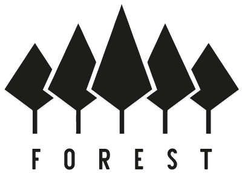

<p align="center">
  
</p>


[](https://app.circleci.com/pipelines/github/ChainSafe/forest?branch=main)
[](https://github.com/ChainSafe/forest/releases/latest)
[](https://opensource.org/licenses/Apache-2.0)
[](https://opensource.org/licenses/MIT)
[](https://twitter.com/ChainSafeth)
[](https://discord.gg/Q6A3YA2)

Forest is an implementation of [Filecoin](https://filecoin.io/) written in Rust. The implementation will take a modular approach to building a full Filecoin node in Rust from the [Filecoin Protocol Specification](https://filecoin-project.github.io/specs/), specifically the virtual machine, blockchain, and node system.

Our crates:

| component | description/crates |
| - | - |
| `forest` | the command-line interface and daemon (1 crate/workspace) |
| `node` | the networking stack and storage (7 crates) |
| `blockchain` | the chain structure and synchronization (6 crates) |
| `vm` | state transition and actors, messages, addresses (9 crates) |
| `key_management` | Filecoin account management (1 crate) |
| `crypto` | cryptographic functions, signatures, and verification (1 crate) |
| `encoding` | serialization library for encoding and decoding (1 crate) |
| `ipld` | the IPLD model for content-addressable data (9 crates) |
| `types` | the forest types (2 crates) |
| `utils` | the forest toolbox (12 crates) |


## Dependencies
`rustc >= 1.55.0`

## Usage
```shell
# Clone repository
git clone --recursive https://github.com/chainsafe/forest
cd forest

# Install binary to $HOME/.cargo/bin and run node
make install
forest
```

To create release binaries, checkout the latest tag and compile with the release feature.
[](https://github.com/ChainSafe/forest/releases/latest)

```shell
git checkout $TAG
cargo build --release --bin forest --features release
```

> `OpenCL`, `hwloc` and a compatible assembly linker (ex. `clang`) are also required to build Filecoin proofs.

### Config

Run the node with custom config and bootnodes

```bash
forest --config /path/to/your_config.toml
```

Example of config options available:

```toml
data_dir = "<directory for all chain and networking data>"
genesis_file = "<relative file path of genesis car file>"

[network]
listening_multiaddr = "<multiaddress>"
bootstrap_peers = ["<multiaddress>"]
```

Example of a [multiaddress](https://github.com/multiformats/multiaddr): `"/ip4/54.186.82.90/tcp/1347/p2p/12D3K1oWKNF7vNFEhnvB45E9mw2B5z6t419W3ziZPLdUDVnLLKGs"`

### Logging

The Forest logger uses [Rust's log filtering options](https://doc.rust-lang.org/1.1.0/log/index.html#filtering-results) with the `RUST_LOG` environment variable.
For example:

```bash
RUST_LOG="debug,forest_libp2p::service=info" forest
```

Will show all debug logs by default, but the `forest_libp2p::service` logs will be limited to `info`

### Testing
```bash
# To run base tests
cargo test # use `make test-release` for longer compilation but faster execution

# To pull serialization vectors submodule and run serialization and conformance tests
make test-vectors

# To run all tests and all features enabled
make test-all
```

### Joining the testnet

Build with the `interopnet` config with:

```bash
make interopnet

# Run and import past the state migrations to latest network version
./target/release/forest --import-snapshot ./types/networks/src/interopnet/snapshot.car
```

Importing the snapshot only needs to happen during the first run. Following this, to restart the daemon run:

```bash
./target/release/forest
```

### Interacting with Forest via CLI

When the Forest daemon is started, an admin token will be displayed. You will need this for commands that require a higher level of authorization (like a password). Forest, as mentioned above, uses multiaddresses for networking. This is no different in the CLI. To set the host and the port to use, if not using the default port or using a remote host, set the `FULLNODE_API_INFO` environment variable. This is also where you can set a token for authentication.

```
FULLNODE_API_INFO="<token goes here>:/ip4/<host>/tcp/<port>/http
```

Note that if a token is not present in the FULLNODE_API_INFO env variable, the colon is removed.

Forest developers will prepend this variable to CLI commands over using `export` on Linux or its equivalant on Windows. This will look like the following:

```
FULLNODE_API_INFO="..." forest auth api-info -p admin
```

### Documentation
_Work in progress_.
- https://chainsafe.github.io/forest/

## Contributing
- Check out our contribution guidelines: [CONTRIBUTING.md](CONTRIBUTING.md)
- Have questions? Say _hi_ on [Discord](https://discord.gg/Q6A3YA2)!

## ChainSafe Security Policy

### Reporting a Security Bug

We take all security issues seriously, if you believe you have found a security issue within a ChainSafe
project please notify us immediately. If an issue is confirmed, we will take all necessary precautions
to ensure a statement and patch release is made in a timely manner.

Please email a description of the flaw and any related information (e.g. reproduction steps, version) to
[security at chainsafe dot io](mailto:security@chainsafe.io).

## License
Forest is dual licensed under [MIT](https://github.com/ChainSafe/forest/blob/main/LICENSE-MIT) + [Apache 2.0](https://github.com/ChainSafe/forest/blob/main/LICENSE-APACHE).
