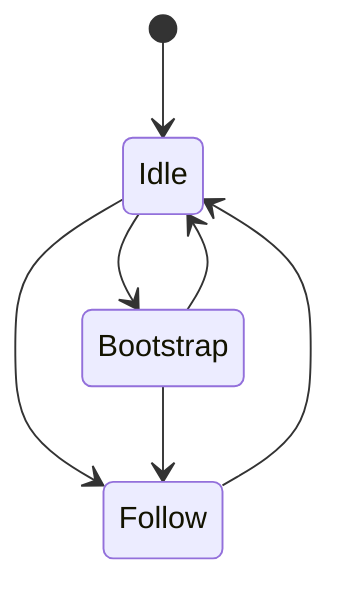
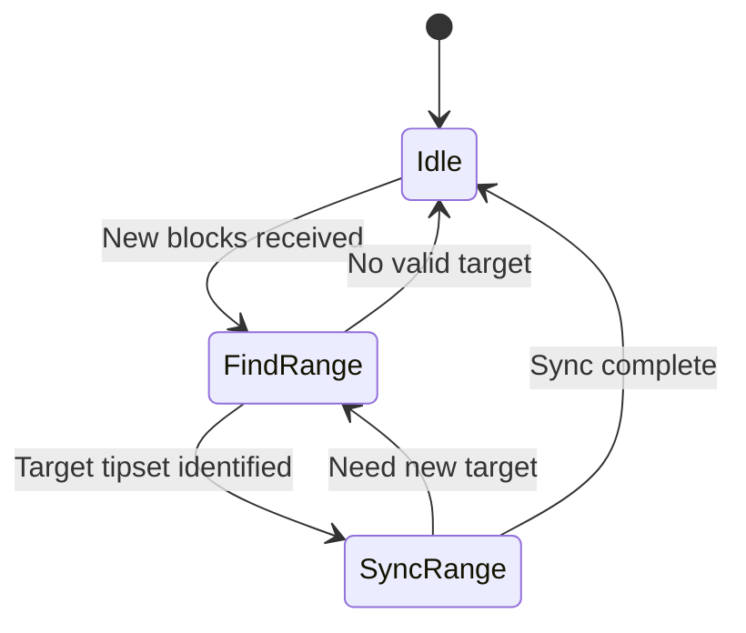
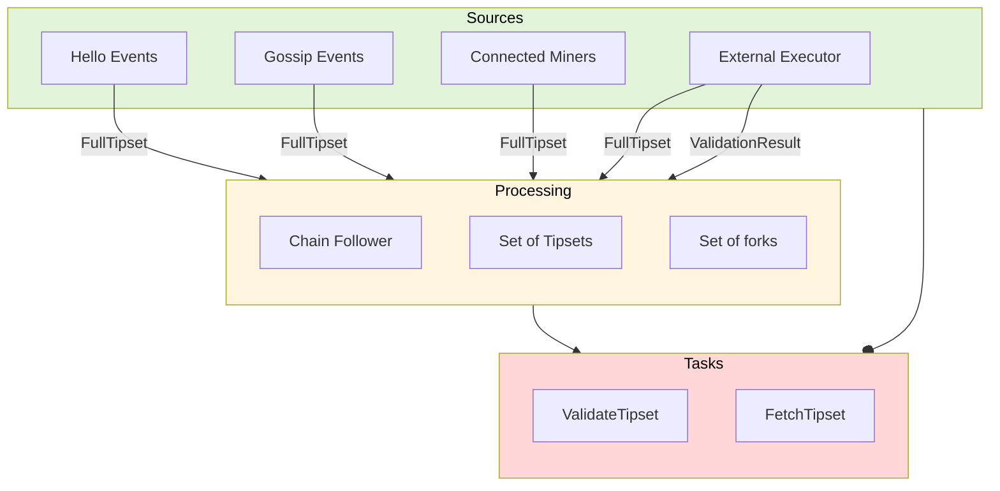

# Chain Muxer

The Chain Muxer operates in three main states:
- **Idle**: The initial state
- **Bootstrap**: State during chain synchronization
- **Follow**: State during normal chain operation

State transitions:
- From Idle, the muxer can transition to either Bootstrap or Follow
- From Bootstrap, it can return to Idle or progress to Follow
- From Follow, it can return to Idle if needed

## TipsetProcessor State Machine

The TipsetProcessor operates in three main states:
- **Idle**: Waiting for new blocks to process
- **FindRange**: Analyzing blocks to determine target tipset and merging loose blocks
- **SyncRange**: Validating blocks and progressing towards the target tipset

State transitions:
- From Idle, enters FindRange when new blocks are received
- FindRange transitions to SyncRange once a valid target tipset is identified
- FindRange can return to Idle if no valid target is found
- SyncRange can return to FindRange if a new target needs to be selected
- SyncRange returns to Idle when synchronization is complete

## Chain Follower Flow

The Chain Follower processes two types of inputs:
- **FullTipset**: Received from multiple sources:
  - Hello Events (initial chain state from new peer connections)
  - Gossip Events (new blocks announced over network)
  - Connected Miners (direct updates from mining nodes)
  - External Executor (processed tipsets)
- **ValidationResult**: Received from:
  - External Executor (results of tipset validation)

Based on the local chain state, it generates two types of tasks:
- **FetchTipset**: When the tipset is unknown and needs to be retrieved
- **ValidateTipset**: When the tipset is available and needs validation

