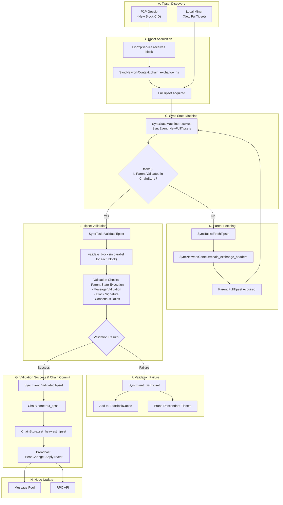

## High-Level Overview

The `ChainFollower` is the orchestrator of the chain synchronization process in Forest. Its main responsibility is to keep the local chain state up-to-date with the Filecoin network's heaviest tipset. It achieves this by:

- Receiving new tipsets from the network (via libp2p gossip) and from local miners.
- Managing a pool of candidate tipsets that are potential heads of the chain.
- Scheduling tasks to either fetch missing parent tipsets or validate tipsets whose parents are already known.
- Executing intensive validation logic to ensure the integrity of each block and its messages.
- Updating the `ChainStore` `struct` with newly validated tipsets, which may involve changing the node's view of the heaviest chain (the "head").

This entire process is managed by a state machine within the [`chain_follower.rs`](https://github.com/ChainSafe/forest/blob/main/src/chain_sync/chain_follower.rs) module, ensuring that tipsets are processed in the correct order and that the node can handle multiple competing forks simultaneously.

## Visual Workflow

## `ChainFollower` Working

The `ChainFollower` `struct` spawns 4 concurrent tasks to sync the chain and track its progress:

1.  **Forward tipsets from peers to the `SyncStateMachine`**: Listens for [`NetworkEvents`](https://github.com/ChainSafe/forest/blob/main/src/libp2p/service.rs), processes incoming blocks from gossip, fetches the `FullTipset` if necessary, and submits it to the state machine.
2.  **Forward tipsets from miners to the `SyncStateMachine`**: Listens on a dedicated channel for locally-produced tipsets submitted via the API.
3.  **Execute `SyncStateMachine` tasks**: Manages the main event loop, taking tasks generated by the `SyncStateMachine` `struct` (like fetching or validating) and spawning them for execution. It also updates the node's overall sync status.
4.  **Periodically report sync progress**: Logs the current sync status at regular intervals, providing visibility into how far behind the network head the node is.

## Details of `ChainFollower` working

### Tipset Fetching

New tipsets are introduced to the `ChainFollower` from two main sources:

- **P2P Network (Gossip):**
  - **File:** `src/libp2p/service.rs`
  - **Flow:** Forest nodes listen on the `/fil/blocks` pubsub topic. When a peer broadcasts a new block, the `Libp2pService` `struct` receives it in the `handle_gossip_event` function. This event is just for a single block's CID. The `ChainFollower` receives this `NetworkEvent::PubsubMessage` and realizes it needs the full block and its sibling blocks to form a `FullTipset`. It then issues a "chain exchange" request to the network using the `chain_exchange_fts` method of the `SyncNetworkContext` `struct` (present in `src/chain_sync/network_context.rs`). This is a direct request to a peer to provide the `FullTipset` corresponding to the block's tipset key.

- **Local Miner:**
  - A connected miner can submit a newly created `FullTipset` directly to the `ChainFollower` through the `tipset_sender` channel field. This bypasses the network fetching step.

### The `SyncStateMachine`

Once a `FullTipset` `struct` is acquired, it's handed over to the `SyncStateMachine` `struct`. This is the core of the chain follower, managing all candidate tipsets and deciding what to do next.

- **State:** The state machine maintains a `tipsets` field (a `HashMap`) of all tipsets it is currently aware of but has not yet fully validated.

- **`SyncEvent` `enum`:** The state machine is driven by `SyncEvent` variants:
  - `NewFullTipsets`: Triggered when a new tipset is discovered. The state machine adds it to its internal `tipsets` map to be processed.
  - `BadTipset`: Triggered when a tipset fails validation. The state machine will remove it and all its descendants from its internal map.
  - `ValidatedTipset`: Triggered when a tipset successfully passes validation. The state machine removes it from its map and commits it to the `ChainStore`.

- **`SyncTask` Generation:** The `tasks()` method of the `SyncStateMachine` is its heart. It iterates through the known tipsets, builds out the potential fork chains, and generates the next set of actions (`SyncTask` `enums`) required to make progress.
  - If a tipsets parent is present in the `ChainStore` (meaning it's already validated), a `SyncTask::ValidateTipset` task is created.
  - If a tipsets parent is not in the `ChainStore`, a `SyncTask::FetchTipset` task is created for the missing parent. This recursive fetching is the important mechanism that allows Forest to sync the chain by walking backward from a given head.

### Tipset Validation

When a `SyncTask::ValidateTipset` task is executed, it kicks off a comprehensive validation process defined in the `validate_block` function in `src/chain_sync/tipset_syncer.rs`. This is the most computationally intensive part of chain synchronization. For each `Block` in the `FullTipset`, the following checks are performed in parallel:

1.  **Parent Tipset State Execution**: This is the most critical step. The `StateManager` `struct` loads the parent tipset and re-executes all of its messages to compute the final state root and message receipt root. These computed roots are compared against the `state_root` and `message_receipts` fields in the current block's header. A mismatch indicates an invalid state transition, and the block is rejected.

2.  **Message Validation**: The `check_block_messages` function performs several checks:
    - The aggregate BLS signature for all BLS messages in the block is verified.
    - The individual signature of every `SecP256k1` message is verified against the sender's key.
    - The `nonce` (sequence number) of each message is checked against the sender's current nonce in the parent state.
    - The `gas_limit` of all messages is summed to ensure it does not exceed the `BLOCK_GAS_LIMIT`.
    - The message root (`TxMeta` `struct`) is re-computed from all messages and compared to the `messages` CID in the block header.

3.  **Block Signature Verification**: The block header's `signature` is verified to ensure it was signed by the declared `miner_address`.

4.  **Consensus Validation**: The `validate_block` method of the `FilecoinConsensus` `struct` is called to verify consensus-specific rules, primarily the `ElectionProof`.

### Handling Bad Blocks

When the `SyncStateMachine` receives a `SyncEvent::BadTipset` event, it takes two important actions to protect the node:

1.  **Cache the Bad Block:** It adds the CID of every block in the failed tipset to the `BadBlockCache` `struct`. This is an LRU cache that prevents the node from wasting resources by re-fetching or re-validating a block that is already known to be invalid. (`src/chain_sync/bad_block_cache.rs`)
2.  **Prune Descendants:** It traverses its internal map of tipsets and removes all known descendants of the bad tipset. Since a child of an invalid block is also invalid, this prunes entire invalid forks from the processing queue.

### Committing to the Chain

If a tipset and all its blocks pass validation, a `SyncEvent::ValidatedTipset` event is sent to the `SyncStateMachine`, which triggers the final step of committing it to the local chain. (`src/chain/store/chain_store.rs`)

1.  **Store the Tipset**: The `SyncStateMachine` calls the `put_tipset` method on the `ChainStore` `struct`.
2.  **Expand the Tipset**: The `put_tipset` method first calls the `expand_tipset` method, which checks the `TipsetTracker` `struct` for any other valid blocks at the same epoch with the same parents. This merges them into a single, more complete tipset, making the view of the head more robust.
3.  **Update the Head**: The new, expanded tipsets weight is compared to the current head's weight in the `update_heaviest` method. If it's heavier, the `set_heaviest_tipset` method of the `ChainStore` is invoked.
4.  **Broadcast Head Change**: The `set_heaviest_tipset` method updates the head in the database and broadcasts a `HeadChange::Apply` event. This notification is critical, as it allows other Forest subsystems like the Message Pool and RPC API to update their own state based on the new head of the chain.
