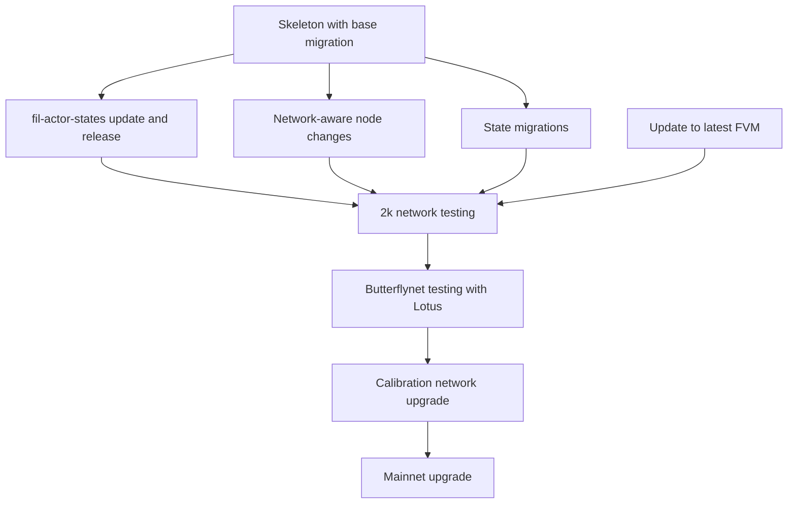

## Network upgrades

This document describes the process of network upgrades in the Filecoin network and how they are handled in Forest.

## Overview

### Network upgrade schedule

The network upgrades rough schedule is published in [Filecoin Core Devs discussions](https://github.com/filecoin-project/core-devs/discussions) (see the [2024 schedule](https://github.com/filecoin-project/core-devs/discussions/155)). The schedule is subject to change, and the exact dates are announced at least two weeks before the upgrade (usually at least a month).

### Network upgrade scope

The network upgrades scope is published in the [Filecoin Core Devs discussions](https://github.com/filecoin-project/core-devs/discussions) (see the [NV23 scope](https://github.com/filecoin-project/core-devs/discussions/149)). The scope includes the changes in the Filecoin protocol in the form of accepted FIPs.

Some FIPs require changes in the FVM, some (most) in the Builtin Actors, and some in the Forest. Additionally, some changes require state migrations, which may not be trivial to implement and require significant computing resources.

### Network upgrade implementation in Forest

Rough implementation steps in Forest are as follows:

#### Skeleton with base migration

This provides the base for the state migrations and network-aware node changes. See the sample PR for NV24 [here](https://github.com/ChainSafe/forest/pull/4819).

#### State migrations

State migrations are described in detail in the relevant FIPs, including the steps required to perform them. Note that naive state migrations might take a significant amount of time and resources. It is up to the implementation team to decide whether to optimize them.

:::note
Testing the state migration on a relevant network is crucial before the upgrade epoch. This could be done by either changing the upgrade epoch in both Lotus and Forest and ensuring both migrations produce the same state root, or comparing the output of `forest-tool shed migrate-state` and `lotus-shed migrate-state` commands.

This also allows for assessing the duration of the state migration and determining whether it is feasible to perform it on the mainnet.
:::

#### Update to latest FVM

Both Forest and the `builtin-actors` repository depend on the FVM. The FVM is updated to the latest version to include the changes required for the network upgrade. The exact version and its release are coordinated across the Filecoin implementations.

#### `fil-actor-states` update and release

The `fil-actor-states` repository is updated to the latest bundle release. The changes are then released, and the Forest repository is updated to include the new release. Necessary CIDs are updated. The bundle release and the version to be used are coordinated across the Filecoin implementations.

#### Network-aware node changes

Some changes are required in the Forest itself but outside migrations. These changes are usually related to the network upgrade itself, e.g., changes in the block validation rules.

#### 2k network testing

The changes are tested locally on the devnet with a Lotus RC and a `builtin-actors` bundle RC.

#### Butterflynet testing with Lotus

The changes are tested on the Butterflynet. The FilOz team provides a testnet for this purpose and shares necessary resources with other teams so they can join the network.

#### Calibration network upgrade

The changes are battle-tested on the calibnet. All teams join the network and test the changes in a real-world scenario. This is the last stage before the mainnet upgrade.

#### Mainnet upgrade

The changes are deployed on the mainnet. The upgrade is coordinated across the Filecoin implementations.

## Dependencies

### Builtin Actors

Forest network upgrades usually depend on new bundle releases of the Filecoin Builtin Actors. The releases can be found [here](https://github.com/filecoin-project/builtin-actors/releases). On top of the new bundle, the Forest team is maintaining a _fork_ of this repository, which contains mainly the same code as the original repository but with some changes to make it compatible with Forest and without smart contract quirks. Thanks to this, we don't need to maintain our interfaces and can use the original ones (almost) directly. The repository can be found [here](https://github.com/ChainSafe/fil-actor-states). This comes at the cost of maintaining the fork up-to-date with the original repository and cutting new releases when bundle changes are in place; see a sample [sync PR](https://github.com/ChainSafe/fil-actor-states/pull/311).

The steps required to update the Builtin Actors in Forest are as follows:

1. Update the `fil-actor-states` repository to the tag of the new bundle release.
2. Ensure that the changes are compatible with Forest. If not, prepare a PR ahead of time to address breaking changes.
3. Cut a new release of the `fil-actor-states`.
4. Update the `fil-actor-states` dependency in Forest.
5. Update the CIDs in the [bundle module](https://github.com/ChainSafe/forest/blob/main/src/networks/actors_bundle.rs) to include bundles for any networks that you want to support.
6. Update the manifest with `forest-tool state-migration generate-actors-metadata > build/manifest.json`. This will add necessary entries to the manifest.

Note that if there were no Rust interface changes, e.g., a re-tag, steps 1-4 can be skipped.

### FVM

:::warning
FVM does not follow semantic versioning. This means that a seemingly hotfix update can contain breaking changes.
:::

Depending on the changes in the network upgrade, an FVM upgrade might be necessary. This can be either a _soft_ upgrade with a limited number of breaking changes, e.g., `4.3.1` to `4.3.2`, or a _hard_ upgrade where the changes are significant, e.g., `4.3.1` to `5.0.0`. The latter requires more development effort and testing.

The steps required to update the FVM in Forest (soft upgrade) are as follows:

1. Update the FVM dependency in the `fil-actor-states` repository.
2. Ensure that the changes are compatible with Forest. If not, prepare a PR ahead of time to address breaking changes.
3. Cut a new release of the `fil-actor-states`.
4. Update the `fil-actor-states` dependency in Forest.
5. Update the FVM in the Forest repository. The relevant entries in the changelog are `fvmX` and `fvm_sharedX`, where `X` is the major version of the FVM.

## Coordination

The most crucial part of the network upgrade is coordinating with other Filecoin implementation teams. The upgrades are coordinated by the [FilOz team](https://www.filoz.org). The coordination happens during the fortnightly Filecoin Implementers calls and the `#fil-implementers` channel in the Filecoin Slack. It includes the upgrade date, the expected duration, and the scope of the required changes.

## Communication

We communicate the network upgrades via the following channels:

- [Forest Discussions](https://github.com/ChainSafe/forest/discussions). See the [NV23 announcement](https://github.com/ChainSafe/forest/discussions/4488) for an example.
- The `#fil-forest-announcements` channel in the Filecoin Slack.

## Network upgrade monitoring

Given the impact of network upgrades and potential issues they cause around the upgrade time, all development teams should monitor the upgrade process and address potential issues as soon as possible. Usually, an upgrade room is created on Zoom, and the link to it is shared with the implementers.

On the Forest side, developers monitoring the upgrade should:

- have a running node (latest release) synced to the network and following the chain,
- immediately investigate all unexpected node behavior around the network upgrade, be it state mismatch or other warnings/errors not happening in the past,
- join the network monitoring room on Zoom and actively participate in the discussions, especially when comparing the state after the upgrade,
- contact the Forest infrastructure team, which might be directly affected if anything on the Forest side goes awry. An emergency fix and snapshot might be needed for them.

Some commands useful when asserting Forest parity against Lotus and Venus state after the upgrade:

- `forest-cli chain head -n X` - this will print the last X tipsets to assert that Forest and Lotus are following the same chain and not a fork,
- `forest-cli state compute --epoch X` will print the computed state at the given epoch. We should assert that we reach the same state after 5-10 epochs.

If all goes well, the network should still be monitored for at least one or two hours, and maintainers should be ready to react to issues.
