## Lotus Gateway

[Lotus Gateway](https://lotus.filecoin.io/lotus/configure/gateway/) is a proxy between the Filecoin node and the client. It is designed to run with the Lotus node but can also be used with Forest. It limits the exposed RPC methods and provides rate-limiting mechanisms.

:::note
For more information on configuring Lotus Gateway, refer to [Lotus Gateway documentation](https://lotus.filecoin.io/lotus/configure/gateway/). This guide assumes that your system already has a Lotus Gateway binary.
:::

### Configuring Lotus Gateway

There is not much configuration needed to run Lotus Gateway with Forest.

1. You must export the `FULLNODE_API_INFO` environment variable with the Forest node admin JWT token and its multiaddress. You can find the Forest JWT token in its initialization logs and under the chosen file if you have set the `--save-token <path>` flag. The multiaddress is the same as the one you would use to connect to the Forest node.
2. Choose a port for the Lotus Gateway to listen on. The default is `2346`, but you can choose any port not already in use. If necessary, open the port in your firewall.
3. Ensure the Forest node is running and accessible from the Lotus Gateway.

```bash
export FULLNODE_API_INFO="<TOKEN>:/ip4/127.0.0.1/tcp/2345/http"
lotus-gateway run --listen 0.0.0.0:5432
```

That's it! Forest should now be available only through the Lotus Gateway. You can test it by running a sample command:

```bash
curl http://localhost:5432/rpc/v1 -X POST -H "Content-Type: application/json" --data '{"method":"Filecoin.ChainHead","params":[], "id":1,"jsonrpc":"2.0"}'
```

## 🌲Forest + 🪷 Lotus Gateway + 🐳 Docker Compose = ❤️

If you want to run Forest and Lotus Gateway in a Docker container, you can use Docker Compose. Ensure you have [docker](https://www.docker.com/) installed. This will:

- create a network for the containers to communicate with each other and expose the Lotus Gateway on the configured port,
- download the snapshot and parameter files if they are not already present,
- run the Forest node and Lotus Gateway in separate containers,
- perform required initialization steps,
- restart the containers if they crash or the host machine is restarted.

Forest will be available only in the internal network, and the Lotus Gateway will be available on the host machine, which you can safely expose to the public. This is illustrated in the diagram below:

```mermaid
%%{ init : { "theme": "default", "flowchart": { "nodeSpacing": 50, "rankSpacing": 50 } } }%%
graph TD
  user[👤External User]
  host[🖥️ Host Machine]

  subgraph forest_internal_network
    style forest_internal_network fill:#e0f0ff,stroke:#3399ff,color:#000
    forest[Container: 🌲forest]
    style forest fill:#d4f4dd,stroke:#2e8b57,color:#000
    forest_gateway[Container: 🪷 forest-gateway]
    style forest_gateway fill:#cce5ff,stroke:#3399ff,color:#000
  end

  user -->|JSON-RPC| host
  host -->|Port Forward| forest_gateway
  forest_gateway -->|JSON-RPC| forest
```



First run might be slower due to the need to download the snapshot. Consecutive runs will be faster.

```bash
docker compose up --detach
```

`.env` file:

```
FOREST_IMAGE=ghcr.io/chainsafe/forest:v0.25.3-fat
LOTUS_IMAGE=filecoin/lotus-all-in-one:v1.32.2-calibnet
FIL_PROOFS_PARAMETER_CACHE=/var/tmp/filecoin-proof-parameters
FOREST_RPC_PORT=2345
FOREST_HEALTHZ_RPC_PORT=2346
FOREST_GATEWAY_PORT=5432
FOREST_KEYSTORE_PHRASE="<CHANGE ME>"
CHAIN=calibnet
```

Modify it as needed.

`docker-compose.yml` file:

```yaml
services:
  init:
    image: ${FOREST_IMAGE}
    volumes:
      - node-data:/data
      - filecoin-proofs:${FIL_PROOFS_PARAMETER_CACHE}
    networks:
      - forest-internal
    environment:
      - FIL_PROOFS_PARAMETER_CACHE=${FIL_PROOFS_PARAMETER_CACHE}
    entrypoint: ["/bin/bash", "-c"]
    command:
      - |
        set -euxo pipefail
        forest --version
        # fetch parameter files
        forest-tool fetch-params --keys
        # if there are some files in the data directory, then we don't need to fetch the snapshot
        if [ "$$(ls -A /data/*.car.zst)" ]; then
          echo "Snapshot already fetched"
        else
          forest-tool snapshot fetch --chain calibnet -d /data
        fi
  forest:
    depends_on:
      init:
        condition: service_completed_successfully
    image: ${FOREST_IMAGE}
    volumes:
      - node-data:/data
      - filecoin-proofs:${FIL_PROOFS_PARAMETER_CACHE}
    networks:
      - forest-internal
    environment:
      - FIL_PROOFS_PARAMETER_CACHE=${FIL_PROOFS_PARAMETER_CACHE}
      - FULLNODE_API_INFO=/dns/forest/tcp/${FOREST_RPC_PORT}/http
      - FOREST_CHAIN_INDEXER_ENABLED=1
      - FOREST_KEYSTORE_PHRASE=${FOREST_KEYSTORE_PHRASE}
    entrypoint: ["/bin/bash", "-c"]
    restart: unless-stopped
    command:
      - |
        set -euxo pipefail
        # Perform basic initliazation, including generating the JWT token
        forest --chain ${CHAIN} --no-gc \
          --exit-after-init --save-token /data/forest-token

        forest --chain ${CHAIN} --no-gc \
          --rpc-address 0.0.0.0:${FOREST_RPC_PORT} \
          --import-snapshot $(ls /data/*.car.zst | tail -n 1) \
          --healthcheck-address 0.0.0.0:${FOREST_HEALTHZ_RPC_PORT} \
          --import-mode=symlink
    healthcheck:
      test: ["CMD", "forest-cli", "sync", "wait"]
      interval: 15s
      timeout: 10m
      retries: 3
      start_period: 10m
  forest-gateway:
    depends_on:
      forest-rpc-ready:
        condition: service_completed_successfully
    image: ${LOTUS_IMAGE}
    volumes:
      - node-data:/data
    networks:
      - forest-internal
    ports:
      - ${FOREST_GATEWAY_PORT}:${FOREST_GATEWAY_PORT}
    entrypoint: ["/bin/bash", "-c"]
    restart: unless-stopped
    command:
      - |
        set -euxo pipefail
        export FULLNODE_API_INFO="$(cat /data/forest-token):/dns/forest/tcp/${FOREST_RPC_PORT}/http"
        lotus-gateway run --listen 0.0.0.0:${FOREST_GATEWAY_PORT}
  forest-rpc-ready:
    depends_on:
      forest:
        condition: service_healthy
    image: ${FOREST_IMAGE}
    volumes:
      - node-data:/data
    networks:
      - forest-internal
    entrypoint: ["/bin/bash", "-c"]
    command:
      - |
        set -euo pipefail

        export FULLNODE_API_INFO="$(cat /data/forest-token):/dns/forest/tcp/${FOREST_RPC_PORT}/http"
        echo "Waiting till Forest is ready"
        forest-cli healthcheck ready --healthcheck-port ${FOREST_HEALTHZ_RPC_PORT} --wait
  post-setup:
    depends_on:
      forest-rpc-ready:
        condition: service_completed_successfully
    image: busybox
    entrypoint: ["/bin/sh", "-c"]
    command:
      - echo "Success"

volumes:
  filecoin-proofs:
  node-data:

networks:
  forest-internal:
```
