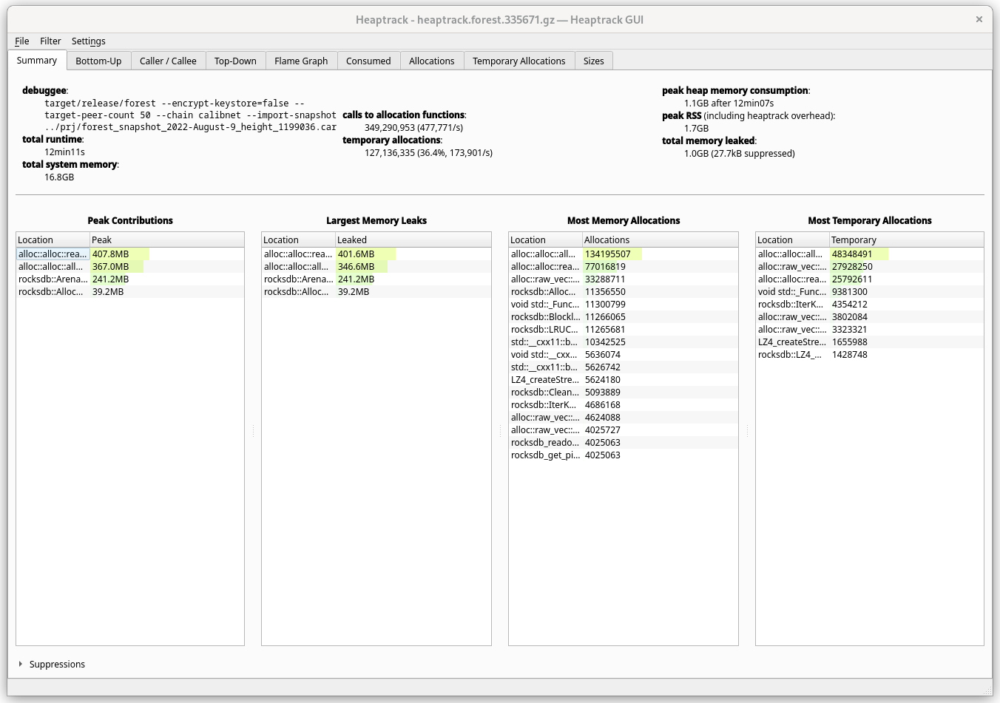
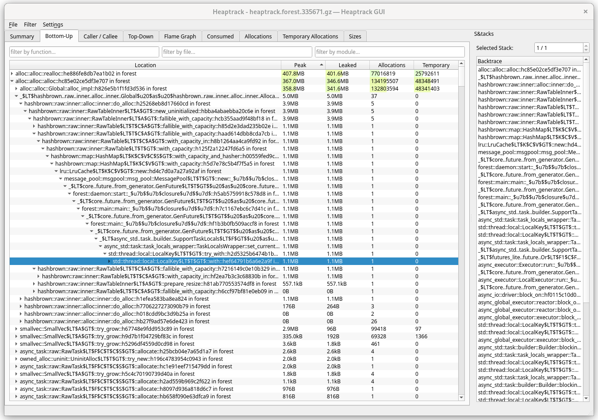
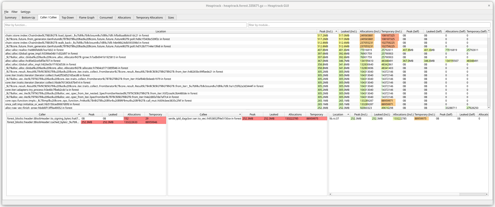
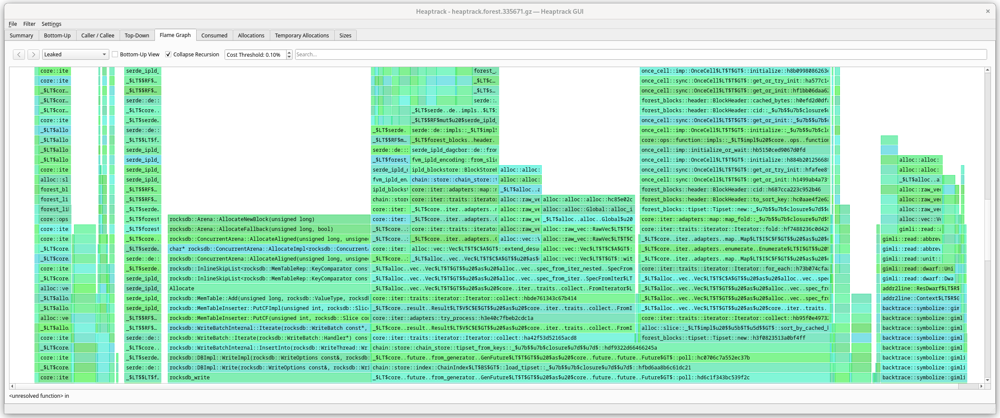
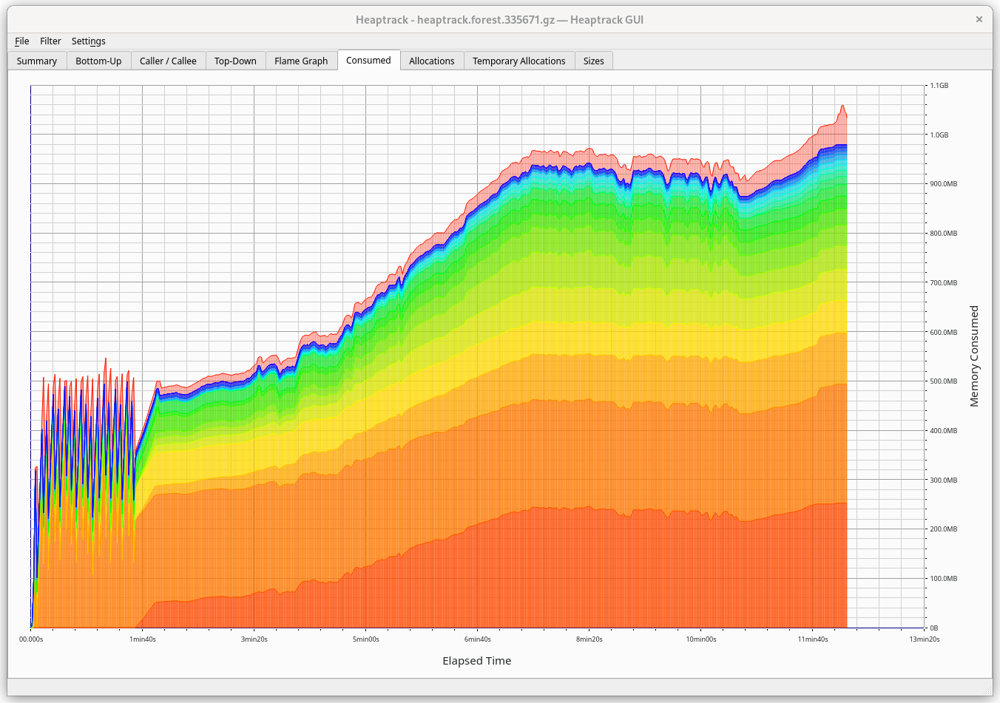
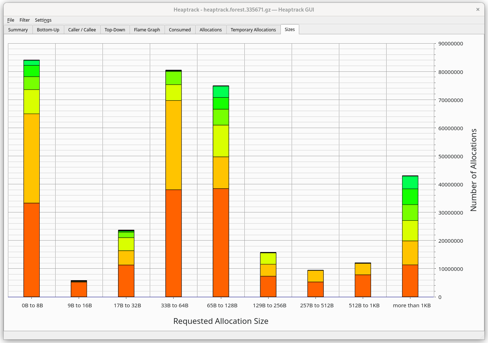

In case of memory leaks, either coming from *unsafe* libraries or just Forest pushing shamelessly into some collection, it is useful to not guess where the leak happened but to use proper tooling.

# [HeapTrack](https://github.com/KDE/heaptrack)

## Installation
Either build it with the instructions provided in the repository or download a ready AppImage, e.g. from [here](https://invent.kde.org/sdk/heaptrack/-/releases). You may not want to use the `heaptrack` available in your OS packages as it may be a bit outdated.

## Preparation
To get the most out of the tool, you may want to add debug information to the binary, regardless if you are running it in release or debug mode.

```toml
[profile.dev]
debug = 2

[profile.release]
debug = 2
```

## Usage
You can grab the trace on your host machine or in a VPS (e.g. Digital Ocean Droplet). 

Start tracing with `heaptrack <normal forest command>`, e.g. 

```
heaptrack target/release/forest --encrypt-keystore=false --target-peer-count 50 --chain calibnet --import-snapshot forest_snapshot.car
```

This will push traces to a file, e.g. `heaptrack.forest.12345.gz`. The longer your process will be running, the bigger it will get, so double check your free space before leaving it overnight.

Now analyze the trace. You can do it after Forest has e.g. crashed due to OOM or even during its execution. If you were capturing traces in a Droplet, copy the file to your host, e.g. `scp chainsafe@123.45.66.77:/home/chainsafe/heaptrack.forest.12345.gz .`.

Depending on the size of the trace, it may take a while (but there is a nice progress bar so you will know if you can grab a coffee in the meantime).

```
heaptrack --analyze heaptrack.forest.12345.gz
```


### Summary
Here we can see memory usage overview. Keep in mind that *leaks* here are not necessarily leaks - it's just memory that hasn't been yet freed. A global cache would always show as a leak.

While most of the potential *culpripts* are not necessarily interesting (e.g. `alloc::*`) because even a `String` constructor calls them, we immediately see that among specific ones, it's the `rocksdb` that gets into the spotlight.



### Bottom-up
View in which you see *low-level* methods first. In such view, the first methods would almost always be allocator methods, finally unwinding into `main`.



### Caller/callee
All the methods called along with their allocations, where one can easily navigate between their callers and callees, also showing you the location in code (you can configure `heaptrack` to take you to that code with `Settings/Code Navigation`). Most useful tab when you delve into the details.



### Top-down 
Basically an inverse of *Bottom-up* view. High-level methods first, then you can drill down.

### Flamegraph
A graphical form of Bottom-up and Top-Down (you can switch). Helps with visualizing the heavy allocators.



### Consumed
Shows the heap memory consumption over time. Here we can notice some patterns, e.g. what happens with memory during snapshot import, then downloading headers and syncing.



### Allocations
Shows total number of allocations over time.

### Temporary allocations
Shows the number of temporary allocations over time. Temporary allocation is an allocation followed by its deallocation, i.e. there are no other allocations in-between.

### Sizes

This tab will show you the allocation sizes during runtime and their frequency. If you hover over a bar you will see that e.g. `LZ4_createStream` (most likely used by `rocksdb`) made 5,624,180 allocations, total 92.3G, on average 14.4kB per allocation.



### Miscallenous

- Keep in mind that running Forest *with* heaptrack gives a non-negligible memory and CPU overhead. You may not be able to run mainnet node on a 16G machine even if normally it would be fine.
- Optimizations may play tricks on the developer, e.g. inlining functions so they won't even appear in your trace. If you think a particular method should have been called but for mysterious reasons it does not appear in the analysis, you may want to put `#[inline(never)]` on top of it. Analyzing a debug build may also be useful, but depending on where the leak happens, it may be too slow.
- There is a lot of noise coming from dependencies and standard library. It's useful to mentally filter them out a bit and focus on the biggest culprits in Forest methods. Flamegraph and caller/calee view are the most useful for this.
