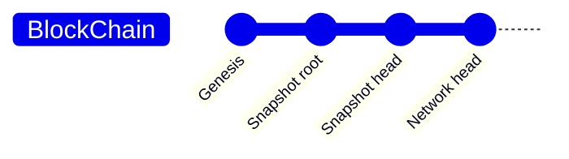
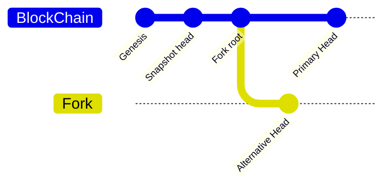
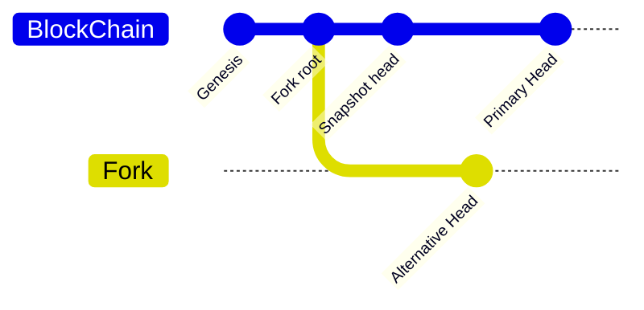
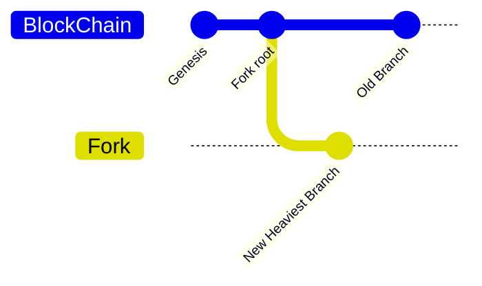
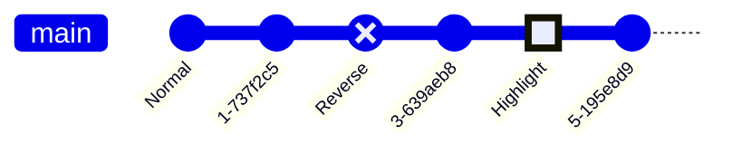

# Filecoin Blockchain State Machine

## Definitions

Epoch = Incremental sequence since genesis. One epoch per 30 seconds for mainnet
and calibnet.

Block = Epoch + Set of messages + Reference to parent tipset + Reference to the
state-hash of the previous tipset.

Tipset = Set of blocks with the same Epoch.

Finality = Cut-off limit in epochs for received blocks. Set to 900 epochs for
mainnet and calibnet. If a node receives a block older than 900 epochs, the
block must be ignored. If the block is younger than 900 epochs, the chain may
have forked and we should calculate which branch is the heaviest.

## Notes

State-hashes can only be checked for the _parent_ of a block. That is, only when
we receive a block for epoch N+1 can we verify that the state-hash for epoch N
is correct.

## Goals

 - Robust handling of unexpected situations.
 - Resistent to deliberate attacks.
 - Simple enough to be obviously correct.
 - Known worst-case memory usage.
 - Low best-case memory usage.

## 2023 algorithm (THIS ALGORITHM WILL BE REPLACED)

BOOTSTRAP:

(HEAD is heaviest local tipset)

 1. Get 5 (`DEFAULT_TIPSET_SAMPLE_SIZE`) tipsets from `HelloResponse` messages.
 2. Take the heaviest of those tipsets and set it as the target.
 3. If TARGET is within 1 epoch of HEAD, goto FOLLOW mode.
 3. Download tipsets between HEAD and TARGET using `ChainExchangeRequest`.
 4. Evaluate each tipset and update HEAD.
 5. Goto step 1.

FOLLOW:
 1. Collect blockheaders from gossip protocol.
 2. Scan backwards 500 (`FORK_LENGTH_THRESHOLD`) steps to find a common ancestor in case of a fork.
 3. Validate tipsets up to the new proposed HEAD.
 4. Update HEAD.
 5. Goto step 1.

This BOOTSTRAP/FOLLOW algorithm is difficult to understand and it is fragile
(both against unexpected messages and adversarial messages).

## Scenarios

### No forks, starting from snapshot

### Two active chains, starting from snapshot before the fork

### Two active chains, starting from snapshot after the fork

### Two active chains, synced, new chain becomes heaviest

## New state-machine

We receive block-headers from the gossip protocol

### State

State of a Filecoin node:
    Heaviest tipset
    Forks:
        Heaviest tipset
        Ancestor tipset
    Known block headers
    Bad blocks

### Properties

 * Orphans
 * Roots

### Methods

 * `fn mark_bad_block(&mut self, block_id: Cid)`
 * `fn add_block_header(&mut self, block_header: BlockHeader)`

Derivatives:
    Orphans
    Roots

Situations to consider:
    Catching up when we're more than chain-finality behind.
    Forks due to consensus disagreements.
    Forks due to mining attacks.

Bootstrap situation:
    Receive BlockHeader from p2p gossip
    Add block to state.
    State now has an orphan.
    Request orphan parents from p2p nodes.

Memory bounds.
