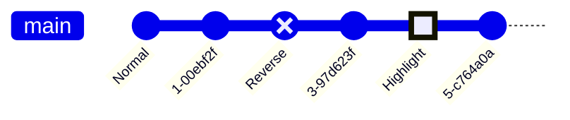

# Filecoin Blockchain State Machine

Epoch = Incremental sequence since genesis. One epoch per 30 seconds for mainnet and calibnet.
Block = Epoch + Set of messages + Reference to parent tipset + Reference to the state-hash of the previous tipset.
Tipset = Set of blocks with the same Epoch.

Finality = Cut-off limit in epochs for received blocks. Set to 900 epochs for mainnet and calibnet. If a node receives a block older than 900 epochs, the block must be ignored. If the block is younger than 900 epochs, the chain may have forked and we should calculate which branch is the heaviest.

Peculiarity: State-hashes can only be checked for the _parent_ of a block. That is, only when we receive a block for epoch N+1 can we verify that the state-hash for epoch N is correct.

State of a Filecoin node:
    Current time in epochs.
    Heaviest tipset
    Forks:
        Heaviest tipset
        Ancestor tipset

