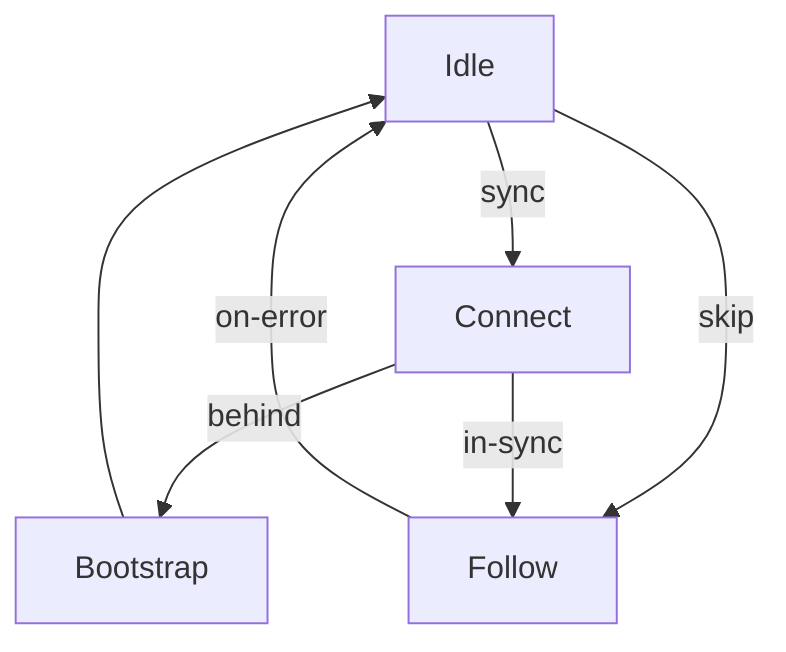
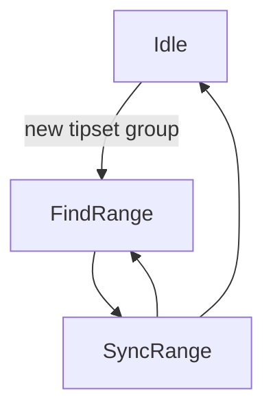

`ChainMuxer` state transitions:

Once the `ChainMuxer` is in `follow` mode, it passes control to the
`TipsetProcessor`. A typical start-up sequence looks like this:

1. `idle` state: Immediately switch to `connect` state.
2. `connect` state: Wait for 5 tipsets from peers. If we're within 1 epoch of
   the heaviest seen tipset, switch to `follow` state. Otherwise, switch to
   `bootstrap` state.
3. `bootstrap` state: Fetch tipsets between the heaviest seen tipset and the
   last validated tipset. Validate all of those tipsets and return to `idle`
   state.
4. `follow` state: Pass control to the `TipsetProcessor` state machine.

`TipsetProcessor` state transitions:

