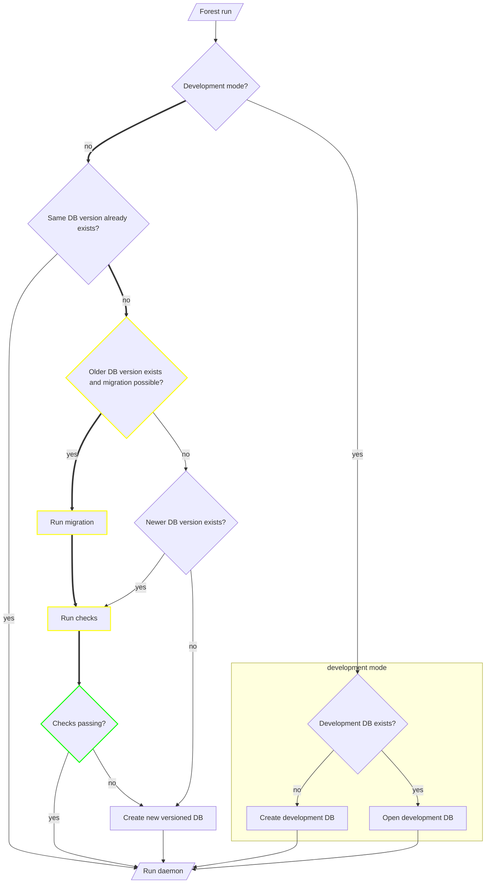
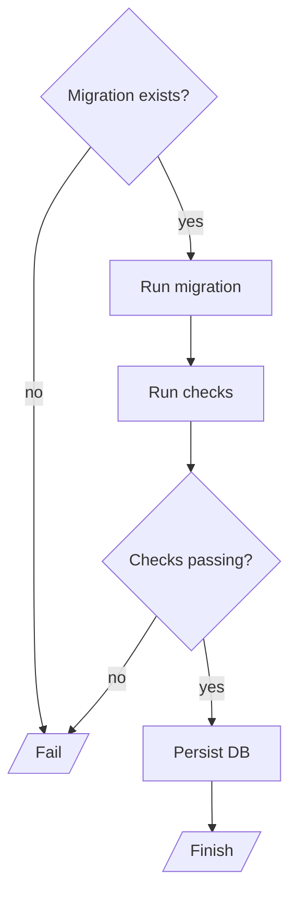
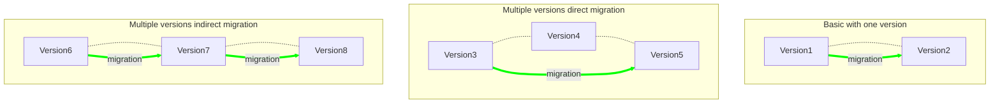

# Database migrations

## Problem

Storing data is one of the prime purposes of Forest, and we often play around
with different layouts and database settings.

Up until now, we've been okay with deleting the database and starting from a
fresh snapshot. This was annoying but acceptable since we never had more than
100GiB of data. Going forward, we'll be setting up nodes with ~14 TiB of data,
and we want them to not require any maintenance when new versions of Forest are
released.

## Proposed solution

High-level flowchart:



Expected migration path is marked in bold.

Note: instead of creating a new database in case of errors, we can choose to
fail the process completely (this will require manual interventions)

### Scenarios to cover

#### Scenario 1: No DB exists

A new DB is created and the daemon is started. If the development environment
variable, the database is created under `<DATA_DIR>/<NETWORK>/paritydb-dev`.
Otherwise, it is created under `<DATA_DIR>/<NETWORK>/paritydb-vX.Y.Z`.

#### Scenario 2: DB exists, but is not the latest version (migration!)

An attempt to migrate the database is made, provided that the migration is
defined. If the migration is not defined, a warning is displayed and Forest will
start under a new database. Alternatively, we can choose to fail the migration
and not start the daemon.

If migration succeeds and the checks are passing, the database is atomically
renamed to `<DATA_DIR>/<NETWORK>/paritydb-vX.Y.Z` and the daemon is started. If
the checks are not passing, the migration is cancelled and we either fail or
start the daemon under a new database.

#### Scenario 3: DB exists and is the latest version

The daemon is started and the database path is not changed.

#### Scenario 4: DB exists and is newer than the daemon version

No migration is performed and the daemon is started. A warning is displayed.
Basic checks are performed to ensure that the database is compatible with the
daemon.

### Use cases

#### Developer, switching to newer branch (development mode)

An attempt will be made to open the database, it may succeed or not.

#### Developer, switching to older branch (development mode)

We don't support migrating down. An attempt will be made to open the database,
it may succeed or not. A possible _development_ database is also the
`<DATA_DIR>/<NETWORK>/paritydb` database (what we currently use).

#### CI, accepting PR with a breaking change

To test that a breaking change is detected and handled correctly, we can use
Forest image with the `latest` tag.

1. Run Forest with the `latest` tag, sync up to the HEAD. We can use volumes to
   share the database between runs.
2. Run Forest from the current branch (re-using the database), sync up to the
   HEAD.

If the database is compatible or a migration is successful, the second run
should be able to sync up to the HEAD. Otherwise, the second run should fail.

#### CI, sync check

Sync check is constantly checking new `edge` versions of Forest. It may be that
there are several breaking changes before we release a new version. Given that
supporting this may be a lot of work (reverts are permitted on `main`) and that
we are not sure if we want to support this, we can simply use the development
mode database for this.

#### User, upgrading to a new version

See scenario 2.

#### User, starting a new node from scratch

See Scenario 4.

### Migration



Note: migration is run on a temporary database. If the checks are passing, the
result is persisted.

### Checking if migration exists

We can use a graph to check if a migration exists. There doesn't have to be a
direct path between two versions.



Note: a migration may not exist by design.

### Example migration

Let's consider the most basic change, a modification in the column settings. A
possible algorithm for the migration is:

```
for each column in the current database:
  for each entry in the column:
    save the entry to a temporary database

if all entries are saved successfully:
  rename the temporary database to the new database
  remove the old database
else:
  fail the migration
```

### Performance considerations

The migration is run on a temporary database. This means that it requires twice
the regular disk space.

### Potential improvements

In development mode, we could potentially try to use the existing versioned
database.
