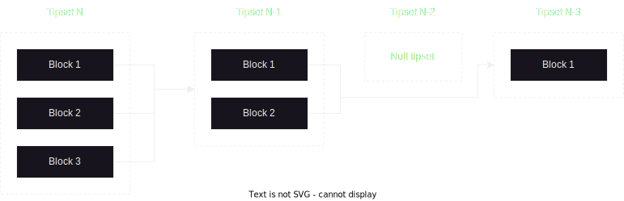

# Filecoin Graph

A Filecoin blockchain is a single [IPLD] [DAG], usually encoded as [CBOR]. The
roots of this graph are called [tipsets](#tipsets). Snapshot files (using the
[CARv1] file format) contain every block header until genesis and (usually) 2000
recent tipsets. These tipsets (together with additional data downloaded from the
p2p network) are sufficient to synchronize with a Filecoin blockchain.

As of writing, the size of the entire Filecoin blockchain graph for `mainnet` is
at 14TiB.

## Tipsets

A [tipset](https://spec.filecoin.io/#section-glossary.tipset) is a set of
[blocks](https://spec.filecoin.io/#section-glossary.block) that were mined at
the same time (e.i. same
[epoch](https://spec.filecoin.io/#section-glossary.epoch)). Filecoin uses a
randomized lottery (with the number of tickets depending on your storage
capacity) to determine who is allowed to mine blocks (and thus get rewards). The
number of winners per epoch is 5 on average but may be zero or any other number.

Tipsets are identified by the set of blocks they contain. Thus, a null tipset
cannot be uniquely identified as it has no blocks. When this happens, blocks
refer to the nearest non-null parent. The picture below shows four tipsets at
epoch `N`, `N-1`, `N-2` and `N-3`. The `N-2` tipset is a null tipset and cannot
be referenced. As such, blocks in tipset `N-1` refer directly to the `N-3`
grand-parent:

## Blocks

A block header primarily contains a timestamp, an epoch, a link to the parent
tipset, a link to the state-tree of the parent, and a link to a set of messages
(i.e., transactions). Blocks are block headers combined with messages. The
Filecoin p2p network gives access to all block headers but not all state-trees
and messages.

## State trees and mesages

State trees are persistent data structures built primarily with persistent
hashmaps ([HAMT]) and persistent vectors ([AMT]). The state tree for a given
epoch will share a lot of nodes with the state tree for the preceding epoch.

Messages are transactions that modify state trees.

Most Filecoin nodes run in lite-mode and only store the most recent state trees
and messages. Only archival nodes have access to the full Filecoin graph (all
messages, all state trees, all blocks, etc).

## Specification

- [Tipset](https://spec.filecoin.io/#section-glossary.tipset)
- [Block](https://spec.filecoin.io/#section-glossary.block)
- [Epoch](https://spec.filecoin.io/#section-glossary.epoch)

# Forest archive

Forest aims at providing data for the following use-cases:

- Quickly syncing to HEAD. This requires up-to-date (less than a day old)
  snapshots.
- Running archival nodes for unique data. State trees can be re-generated given
  enough compute time but block headers and messages cannot. The full block
  history should be available and easily accessible.
- Accessing state-trees at arbitrary epochs. Storage providers are often
  interested in querying the state as it was months or years ago. There should
  be an efficient way of accessing ranges of epoch without downloading the
  entire graph.
- Parallel validation. The Filecoin consensus rules have changed over time, and
  the only way to guarantee compliance is to validate all the historical
  tipsets. For feasibility, this should be done in parallel.

## Buckets

- `/{network}/latest`: Recent snapshots. Old files may be deleted after, say, 72
  hours.
- `/{network}/snapshots`: Historical snapshots at regular epoch intervals. One
  snapshot every 2880\*7 epochs.
- `/{network}/diffs`: Diff files at regular intervals. Diffs are not complete
  snapshots and only contain the new key-value pairs since the previous diff.
- `/{network}/diffs/roll-up`: Union of diffs over a longer time period. Roll-up
  period could be 6 months (2880\*30\*6 epochs). These roll-ups do not contain
  any unique information; they are a more convenient way of downloading diffs.
- `/{network}/spine`: Diff files containing only blocks and messages (i.e., the
  spine of the blockchain). This is the minimal data required to re-compute the
  entire state graph. Diff period could be 1 day (2880 epochs).
- `/{network}/spine/roll-up`: Convenience roll-ups for spine diffs.

These buckets support several use-cases:

- Syncing to HEAD using the latest snapshot from `/{network}/latest`.
- The state-tree for an arbitrary epoch can be downloaded by starting with a
  nearby historical snapshot and then supplementing it with diff files. For
  example, the state-tree for epoch 3000 can be accessed by getting the snapshot
  at epoch 2880 and the diff file for epoch range 2880-5760.
- Initializing a full archival node can be done by downloading all the diff
  roll-ups. Combined, they contain the entire state-graph.
- Running a message archival server can be done by downloading the spine diff
  roll-ups.
- Re-validating tipsets can be done in parallel by merging snapshots and diff
  files.

[IPLD]: https://ipld.io/
[DAG]: https://en.wikipedia.org/wiki/Directed_acyclic_graph
[CBOR]: https://cbor.io/
[CARv1]: https://ipld.io/specs/transport/car/carv1/
[HAMT]: https://ipld.io/specs/advanced-data-layouts/hamt/spec/
[AMT]: https://github.com/filecoin-project/go-amt-ipld
