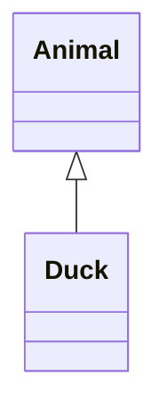

# Filecoin Graph

A Filecoin blockchain is represented as a single [IPLD] [DAG], usually encoded as [CBOR]. The roots of this graph are called [tipsets](#tipsets). Snapshot files (using the [CARv1] file format) usually contain 2000 recent tipsets. These tipsets (together with additional data downloaded from the p2p network) is sufficient to synchronize with a Filecoin blockchain.

As of writing, the size of the entire Filecoin blockchain graph for `mainnet` is at 14TiB.

## Tipsets

A [tipset](https://spec.filecoin.io/#section-glossary.tipset) is a set of [blocks](https://spec.filecoin.io/#section-glossary.block) that were mined at the same time (e.i. same [epoch](https://spec.filecoin.io/#section-glossary.epoch)). Filecoin uses a randomized lottery (with number of tickets depending on your storage capacity) to determine who is allowed to mine block (and thus get rewards). The number of winners per tipset is 5 on average but may be zero or any other number.

Tipsets are identified by the set of blocks it contain. This means a null tipset cannot be uniquely identified as it has no blocks. When this happens, blocks refer to the nearest non-null parent. The picture below shows four tipsets at epoch `N`, `N-1`, `N-2` and `N-3`. The `N-2` tipset is a null tipset and cannot be referenced. As such, blocks in tipset `N-1` refer directly to the `N-3` grand-parent:

## Blocks and block headers

## State trees

## Messages

## Specification

- [Tipset](https://spec.filecoin.io/#section-glossary.tipset)
- [Block](https://spec.filecoin.io/#section-glossary.block)
- [Epoch](https://spec.filecoin.io/#section-glossary.epoch)

[IPLD]: https://ipld.io/
[DAG]: https://en.wikipedia.org/wiki/Directed_acyclic_graph
[CBOR]: https://cbor.io/
[CARv1]: https://ipld.io/specs/transport/car/carv1/
