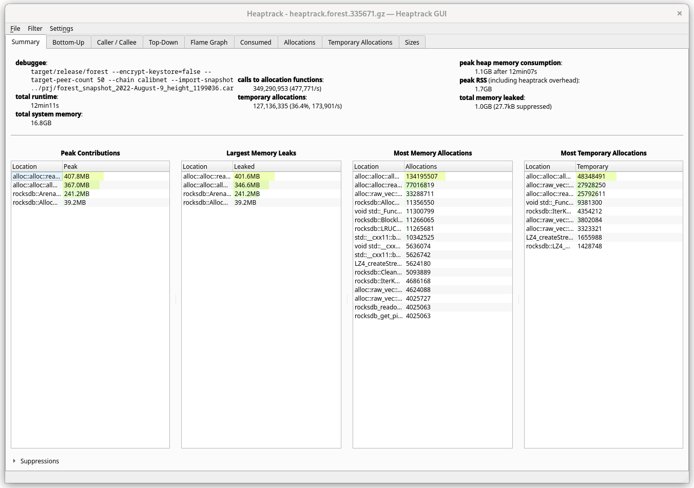
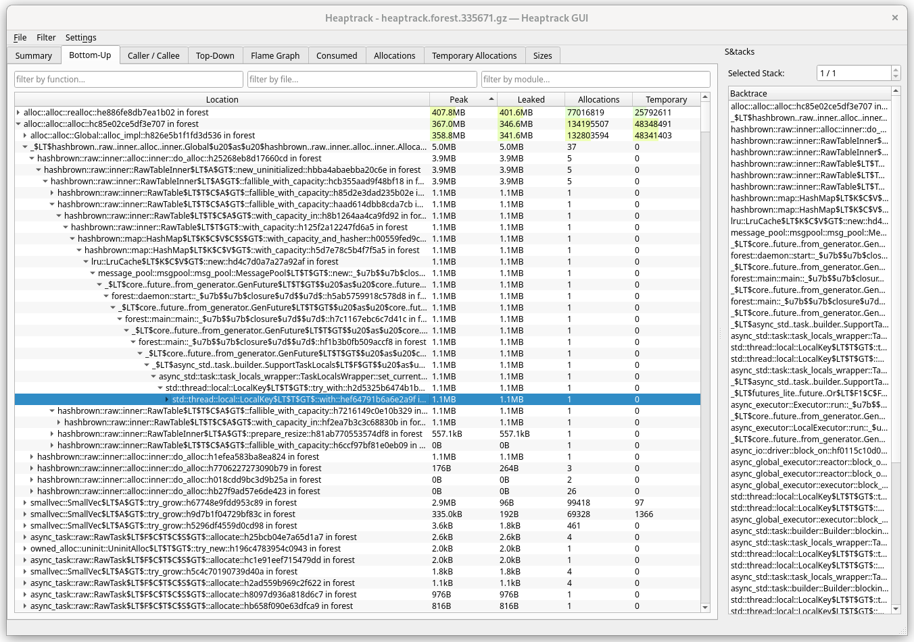
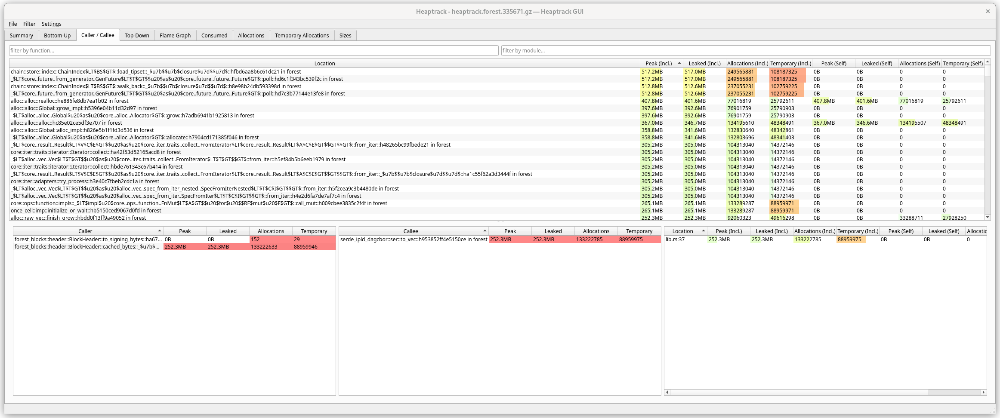
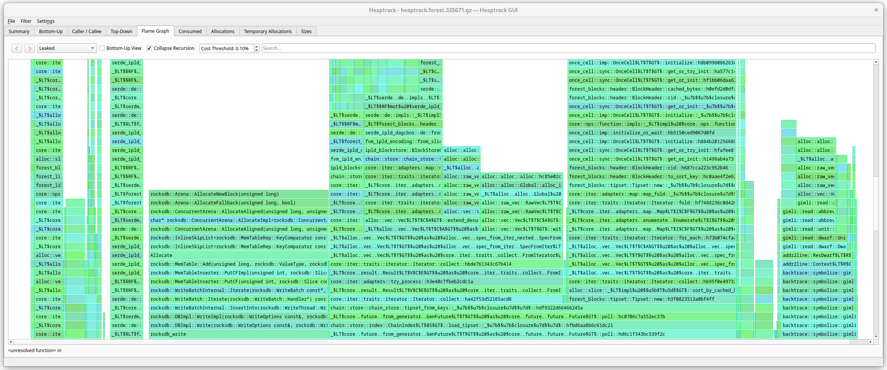
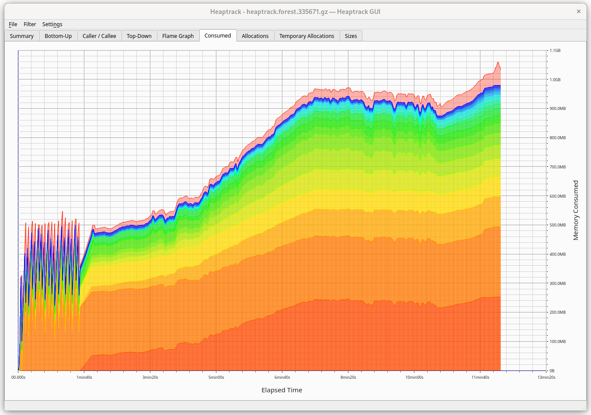
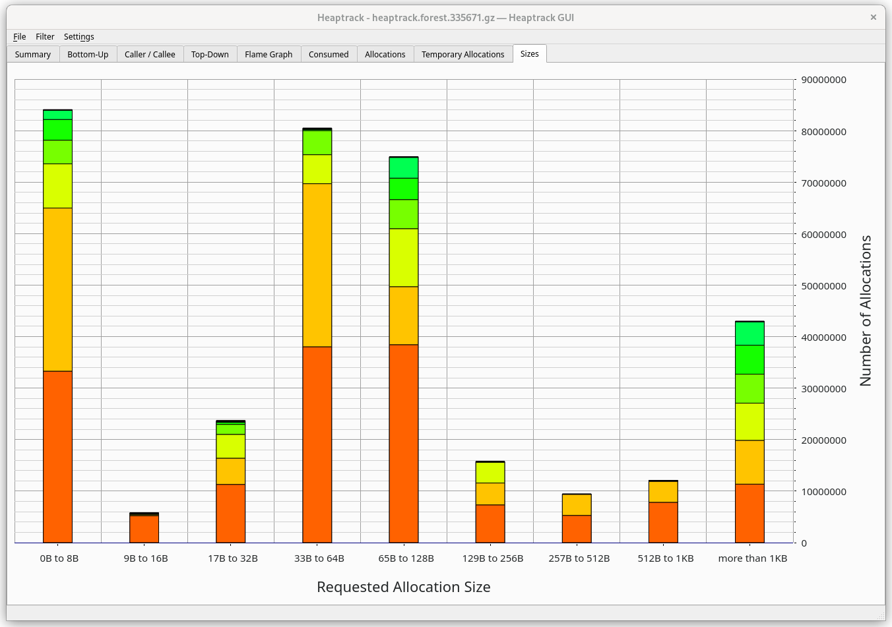

In case of memory leaks, either coming from _unsafe_ libraries or just Forest
pushing shamelessly into some collection, it is useful to not guess where the
leak happened but to use proper tooling.

# [HeapTrack](https://github.com/KDE/heaptrack)

## Installation

Either build it with the instructions provided in the repository or download a
ready AppImage, e.g. from
[here](https://invent.kde.org/sdk/heaptrack/-/releases). You may not want to use
the `heaptrack` available in your OS packages as it may be a bit outdated.

## Preparation

To get the most out of the tool, you may want to add debug information to the
binary, regardless if you are running it in release or debug mode.

```toml
[profile.dev]
debug = 2

[profile.release]
debug = 2
```

## Usage

You can grab the trace on your host machine or in a VPS (e.g. Digital Ocean
Droplet).

Start tracing with `heaptrack <normal forest command>`, e.g.

```
heaptrack target/release/forest --encrypt-keystore=false --target-peer-count 50 --chain calibnet --import-snapshot forest_snapshot.car
```

This will push traces to a file, e.g. `heaptrack.forest.12345.gz`. The longer
your process will be running, the bigger it will get, so double check your free
space before leaving it overnight.

Now analyze the trace. You can do it after Forest has e.g. crashed due to OOM or
even during its execution. If you were capturing traces in a Droplet, copy the
file to your host, e.g.
`scp chainsafe@123.45.66.77:/home/chainsafe/heaptrack.forest.12345.gz .`.

Depending on the size of the trace, it may take a while (but there is a nice
progress bar so you will know if you can grab a coffee in the meantime).

```
heaptrack --analyze heaptrack.forest.12345.gz
```

### Summary

Here we can see memory usage overview. Keep in mind that _leaks_ here are not
necessarily leaks - it's just memory that hasn't been yet freed. A global cache
would always show as a leak.

While most of the potential _culprits_ are not necessarily interesting (e.g.
`alloc::*`) because even a `String` constructor calls them, we immediately see
that among specific ones, it's the `rocksdb` that gets into the spotlight.



### Bottom-up

View in which you see _low-level_ methods first. In such view, the first methods
would almost always be allocator methods, finally unwinding into `main`.



### Caller/callee

All the methods called along with their allocations, where one can easily
navigate between their callers and callees, also showing you the location in
code (you can configure `heaptrack` to take you to that code with
`Settings/Code Navigation`). Most useful tab when you delve into the details.



### Top-down

Basically an inverse of _Bottom-up_ view. High-level methods first, then you can
drill down.

### Flamegraph

A graphical form of Bottom-up and Top-Down (you can switch). Helps with
visualizing the heavy allocators.



### Consumed

Shows the heap memory consumption over time. Here we can notice some patterns,
e.g. what happens with memory during snapshot import, then downloading headers
and syncing.



### Allocations

Shows total number of allocations over time.

### Temporary allocations

Shows the number of temporary allocations over time. Temporary allocation is an
allocation followed by its deallocation, i.e. there are no other allocations
in-between.

### Sizes

This tab will show you the allocation sizes during runtime and their frequency.
If you hover over a bar you will see that e.g. `LZ4_createStream` (most likely
used by `rocksdb`) made 5,624,180 allocations, total 92.3G, on average 14.4kB
per allocation.



### Miscellaneous

- Keep in mind that running Forest _with_ heaptrack gives a non-negligible
  memory and CPU overhead. You may not be able to run mainnet node on a 16G
  machine even if normally it would be fine.
- Optimizations may play tricks on the developer, e.g. inlining functions so
  they won't even appear in your trace. If you think a particular method should
  have been called but for mysterious reasons it does not appear in the
  analysis, you may want to put `#[inline(never)]` on top of it. Analyzing a
  debug build may also be useful, but depending on where the leak happens, it
  may be too slow.
- There is a lot of noise coming from dependencies and standard library. It's
  useful to mentally filter them out a bit and focus on the biggest culprits in
  Forest methods. Flamegraph and caller/callee view are the most useful for
  this.
