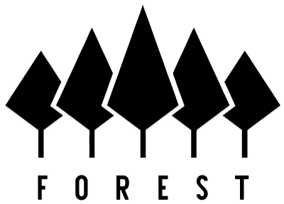

    

Forest is an implementation of [Filecoin](https://filecoin.io/) written in Rust.
The implementation takes a modular approach to building a full Filecoin node in
two parts — (i) building Filecoin’s security critical systems in Rust from the
[Filecoin Protocol Specification](https://filecoin-project.github.io/specs/),
specifically the virtual machine, blockchain, and node system, and (ii)
integrating functional components for storage mining and storage & retrieval
markets to compose a fully functional Filecoin node implementation.

## Functionality

- Filecoin State Tree Synchronization
- Filecoin JSON-RPC Server
- Ergonomic Message Pool
- Wallet CLI
- Process Metrics & Monitoring

## Disclaimer

The Forest implementation of the Filecoin protocol is alpha software which
should not yet be integrated into production workflows. The team is working to
provide reliable, secure, and efficient interfaces to the Filecoin ecosystem. If
you would like to chat, please reach out over Discord on the ChainSafe server
linked above.
