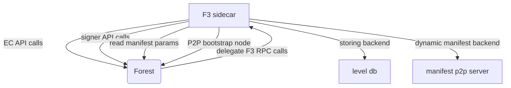

### EC tests

- run a forest node locally and expose RPC port at the default 2345
- run `go test -v .`

### Run sidecar

- run a forest node on calibnet
- import a shared miner key for testing `forest-wallet --remote-wallet import`
  (the shared miner worker key can be found in `scripts/tests/api_compare/.env`)
- run f3 sidecar `go run .`
- (optional) to inspect RPC calls, run
  `mitmproxy --mode reverse:http://localhost:2345 --listen-port 8080` then
  `go run . -rpc http://127.0.0.1:8080/rpc/v1`

### How F3 sidecar interacts with Forest

