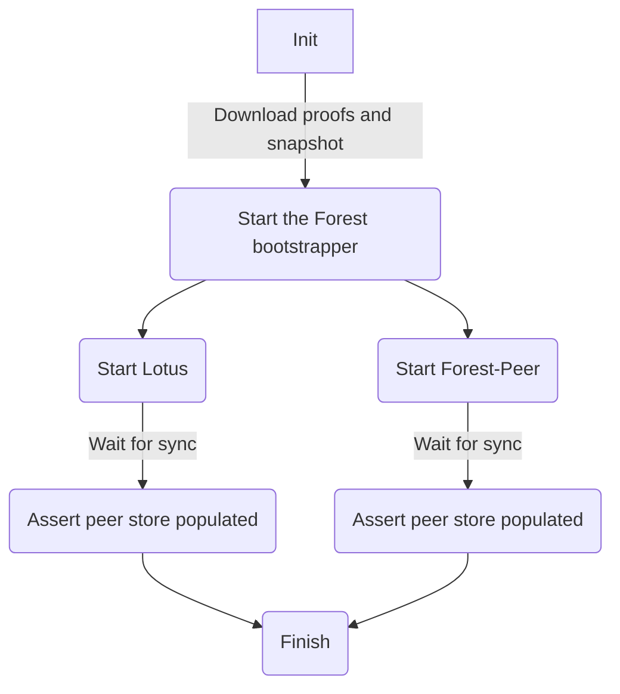

# Forest as a bootstrapper test

The setup here creates a single Forest bootstrap peer with a well-known peer id
and p2p listening port. Then, a secondary Forest and Lotus are created and
connected to that peer. The assertion succeeds if both secondary peers are able
to sync the chain from the bootstrap peer and have multiple peers in their
peerstores.

This is illustrated in the following flowchart:



## Usage

```bash
./setup.sh
```

## Teardown

```bash
docker compose down -v --rmi all
```
