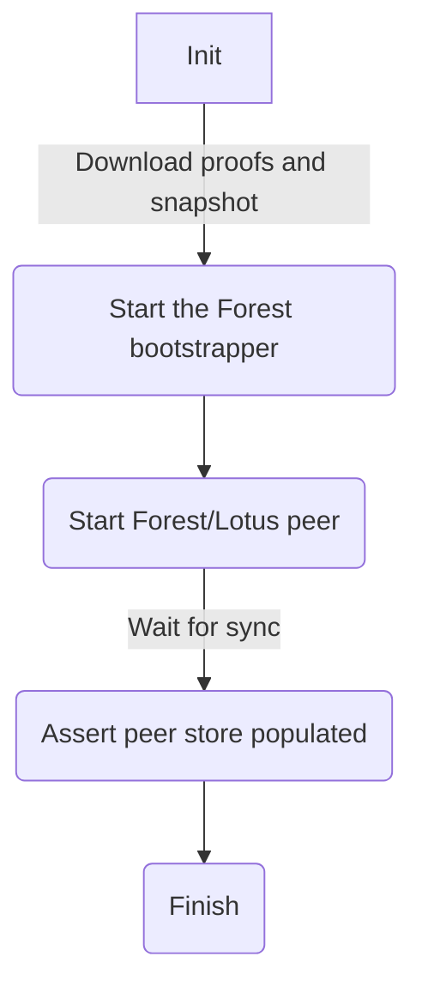

# Forest as a bootstrapper test

The setup here creates a single Forest bootstrap peer with a well-known peer id
and p2p listening port. Then, a secondary Forest or Lotus are created and
connected to that peer. The assertion succeeds if the secondary peer is able to
sync the chain from the bootstrap peer and have multiple peers in their
peerstores.

Note that Lotus and Forest are checked separately, to limit the resources
required for the test.

This is illustrated in the following flowchart:



## Usage

```bash
./test_bootstrapper.sh forest
./test_bootstrapper.sh lotus
```

## `Teardown`

```bash
docker compose -f ./docker-compose-forest.yml down -v --rmi all
docker compose -f ./docker-compose-lotus.yml down -v --rmi all
```
